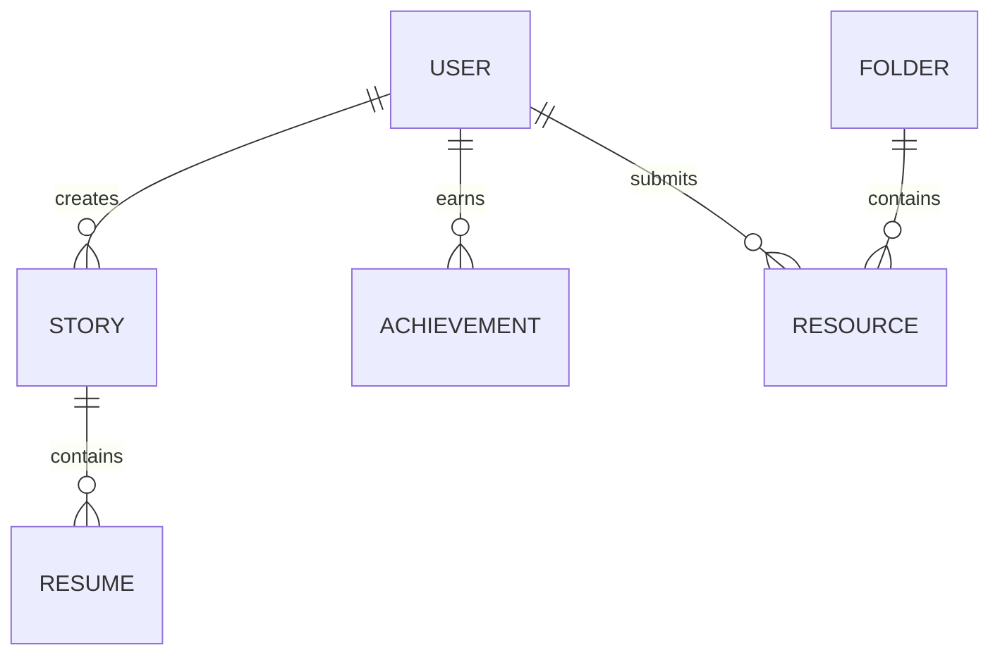

# Database Design

Although MongoDB is not implemented in the Phase 1 repository, this document outlines the proposed database models, validation constraints, and relationships for the full-stack system.

---

## Entity-Relationship Overview

---

## MongoDB Model Schemas

### 1. User Model
Stores credentials, profile information, and roles.

*   `_id`: ObjectId (Primary Key)
*   `name`: String (Required, trim)
*   `email`: String (Required, unique, format: `*@college.edu`)
*   `password`: String (Required, hashed with bcrypt)
*   `role`: String (Enum: `student`, `contributor`, `admin`, default: `student`)
*   `branch`: String (Enum: `CSE`, `AI/DS`, `CE`, `EXTC`)
*   `currentYear`: Number (Enum: `1`, `2`, `3`, `4`)
*   `batch`: String (e.g., `2022-2026`)
*   `passoutYear`: Number (e.g., `2026`)
*   `company`: String (Optional, for alumni/contributors)
*   `jobRole`: String (Optional)
*   `cgpa`: Number (Optional, range: `0.0 - 10.0`)
*   `createdAt`: Date (Default: `Date.now`)

### 2. Story Model
Stores published placement/internship stories.

*   `_id`: ObjectId (Primary Key)
*   `userId`: ObjectId (Reference to `User`, Required)
*   `studentName`: String (Required)
*   `branch`: String (Required)
*   `batch`: String (Required)
*   `passoutYear`: Number (Required)
*   `company`: String (Required)
*   `jobRole`: String (Required)
*   `cgpa`: Number (Optional)
*   `placementYear`: Number (Required)
*   `journey`: Object (Required)
    *   `firstYear`: String
    *   `secondYear`: String
    *   `thirdYear`: String
    *   `fourthYear`: String
*   `strategy`: Object (Required)
    *   `preparation`: String
    *   `interview`: String
    *   `howISecured`: String
    *   `advice`: String
*   `resumeUrl`: String (URL to S3 / Cloudinary)
*   `materialsUrl`: String (Optional)
*   `isApproved`: Boolean (Default: `true`)
*   `createdAt`: Date (Default: `Date.now`)

### 3. PendingStory Model
Stores submitted placement stories awaiting administrator approval. Has identical structure to the `Story` model.

*   `_id`: ObjectId (Primary Key)
*   `userId`: ObjectId (Reference to `User`, Required)
*   `studentName`: String (Required)
*   `branch`: String (Required)
*   `batch`: String (Required)
*   `passoutYear`: Number (Required)
*   `company`: String (Required)
*   `jobRole`: String (Required)
*   `cgpa`: Number (Optional)
*   `journey`: Object (Required)
*   `strategy`: Object (Required)
*   `resumeUrl`: String
*   `isApproved`: Boolean (Default: `false`)
*   `submittedAt`: Date (Default: `Date.now`)

### 4. Folder Model
Represents directories within the resource library.

*   `_id`: ObjectId (Primary Key)
*   `name`: String (Required, unique, e.g., `DSA`, `Core CS`)
*   `description`: String
*   `createdAt`: Date (Default: `Date.now`)

### 5. Resource Model
Stores study resource links or references.

*   `_id`: ObjectId (Primary Key)
*   `folderId`: ObjectId (Reference to `Folder`, Required)
*   `title`: String (Required)
*   `description`: String (Required)
*   `type`: String (Enum: `PDF`, `Link`, `Document`)
*   `url`: String (Required, verified URL)
*   `submittedBy`: ObjectId (Reference to `User`)
*   `isApproved`: Boolean (Default: `true`)
*   `createdAt`: Date (Default: `Date.now`)

### 6. PendingResource Model
Stores student-submitted study resources waiting for admin review. Same structure as `Resource`.

*   `_id`: ObjectId (Primary Key)
*   `folderId`: ObjectId (Reference to `Folder`, Required)
*   `title`: String (Required)
*   `description`: String (Required)
*   `type`: String (Enum: `PDF`, `Link`, `Document`)
*   `url`: String (Required)
*   `submittedBy`: ObjectId (Reference to `User`)
*   `isApproved`: Boolean (Default: `false`)
*   `submittedAt`: Date (Default: `Date.now`)

### 7. Achievement Model
Stores records of student achievements, hackathons, and placement records.

*   `_id`: ObjectId (Primary Key)
*   `title`: String (Required)
*   `category`: String (Enum: `Hackathons`, `Coding Competitions`, `Placements`, `Internships`, `Technical Achievements`)
*   `studentTeam`: String (Required, list of student names or team name)
*   `year`: Number (Required)
*   `description`: String (Required)
*   `imageUrl`: String (Optional)
*   `createdAt`: Date (Default: `Date.now`)
