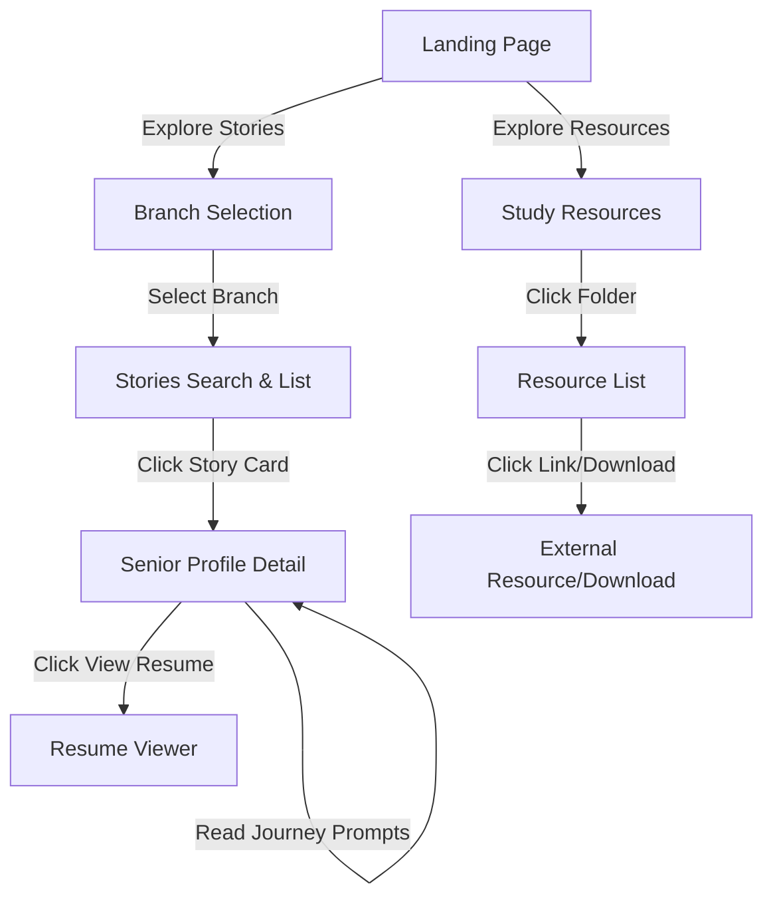
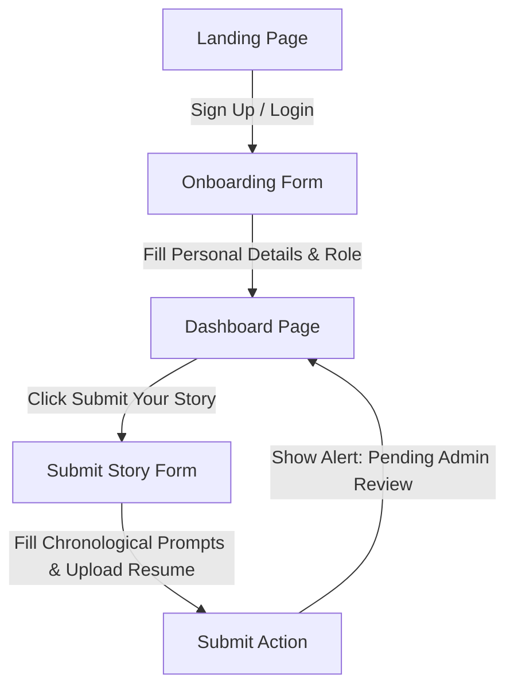
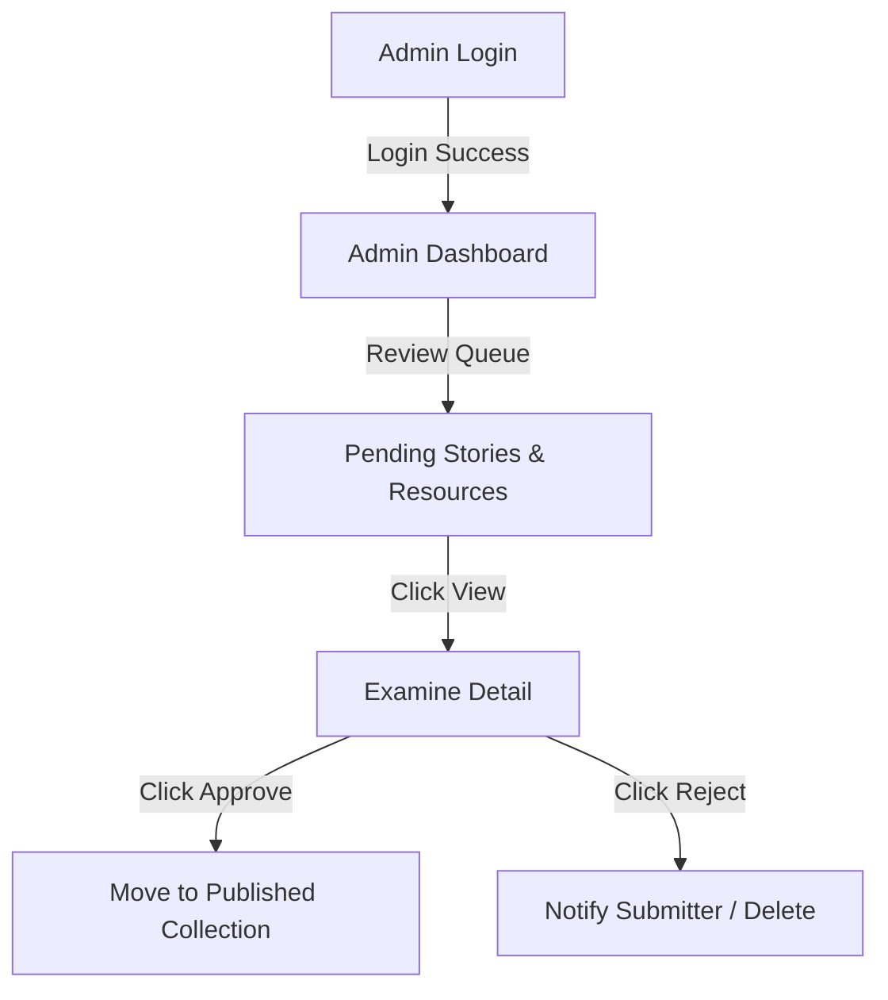

# User Flow

This document details the navigation and interaction flows for the three primary user roles of the LOOP system: Readers (Juniors), Contributors (Seniors/Alumni), and Administrators.

---

## 1. Junior Student Flow (Reading & Learning)

*   **Step 1**: The student arrives on the Landing Page and is greeted by featured stories, branches, and achievements.
*   **Step 2**: They select their branch (e.g., CSE / AI-DS) to filter content automatically.
*   **Step 3**: On the Stories page, they search or filter by company (e.g. Google, Microsoft) or job role.
*   **Step 4**: They open a senior's profile to view chronological stories, preparation strategies, and click to view/download their resume.

---

## 2. Contributor Flow (Onboarding & Submitting)

*   **Step 1**: A senior/alumni signs up and fills out onboarding fields (pass-out year, branch, role: Contributor).
*   **Step 2**: From the dashboard or navbar, they select "Submit Story".
*   **Step 3**: They complete the form by writing answers to prompts (1st to 4th year) and linking their resume.
*   **Step 4**: Upon submission, the story is saved in the pending queue and the contributor receives a success notification.

---

## 3. Administrator Flow (Moderating & Curating)

*   **Step 1**: The administrator logs in to the system.
*   **Step 2**: The Admin Dashboard displays statistics (e.g., active stories, pending items).
*   **Step 3**: The administrator views pending placement stories and resources, reading each entry.
*   **Step 4**: The administrator approves the story to publish it to the student portal, or rejects it.
